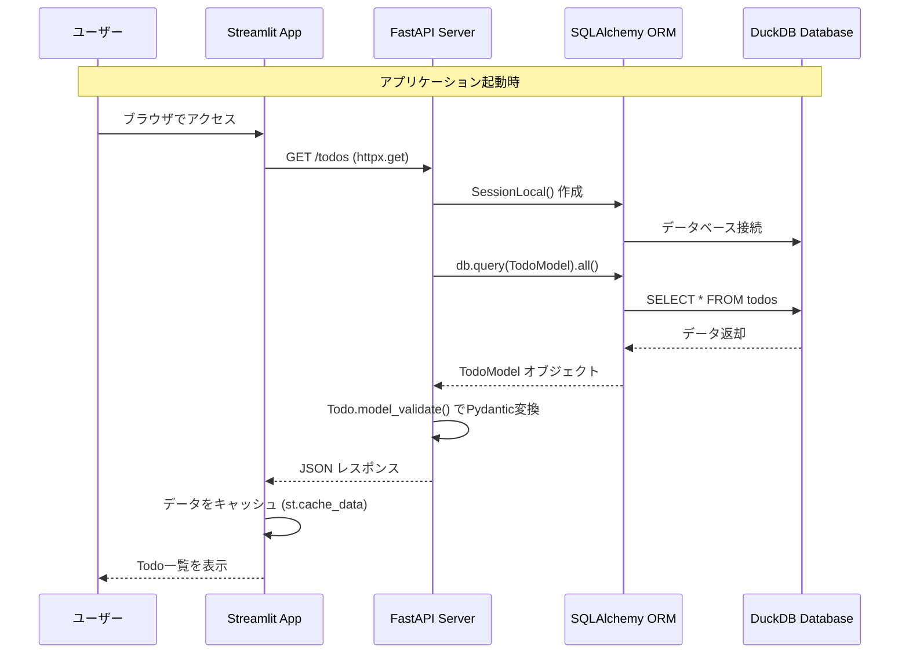
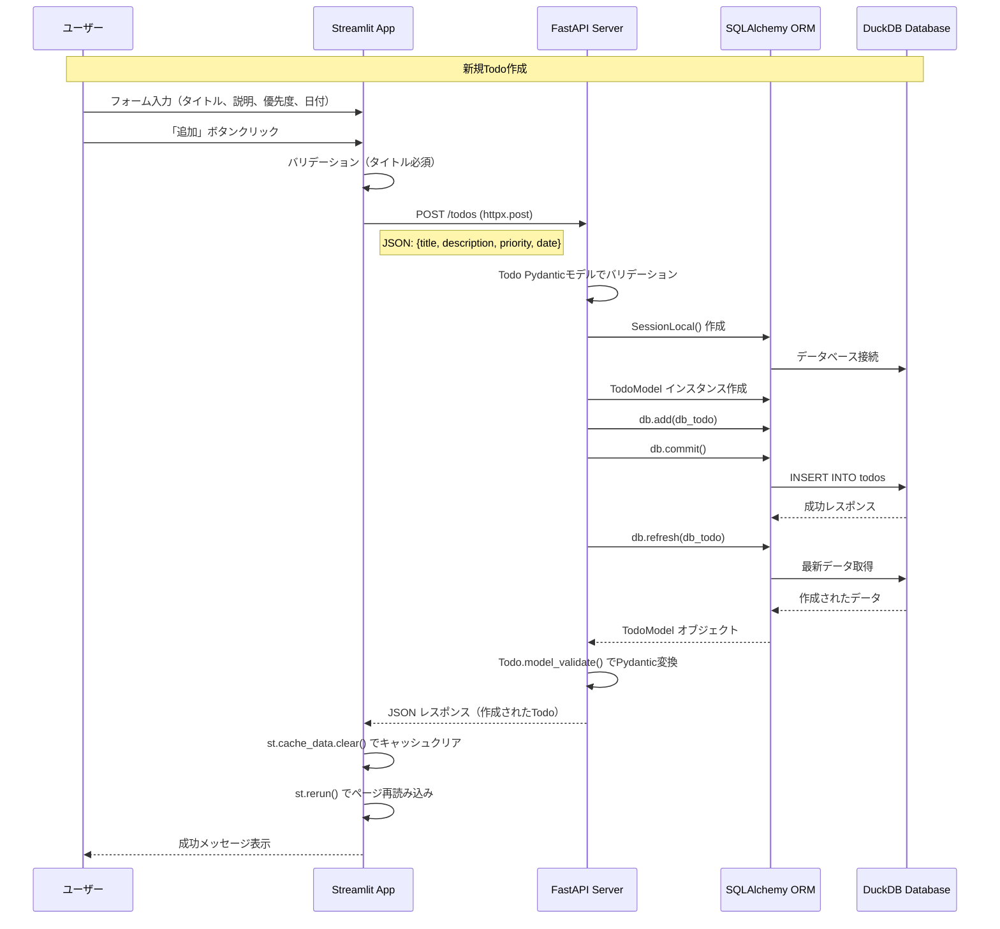
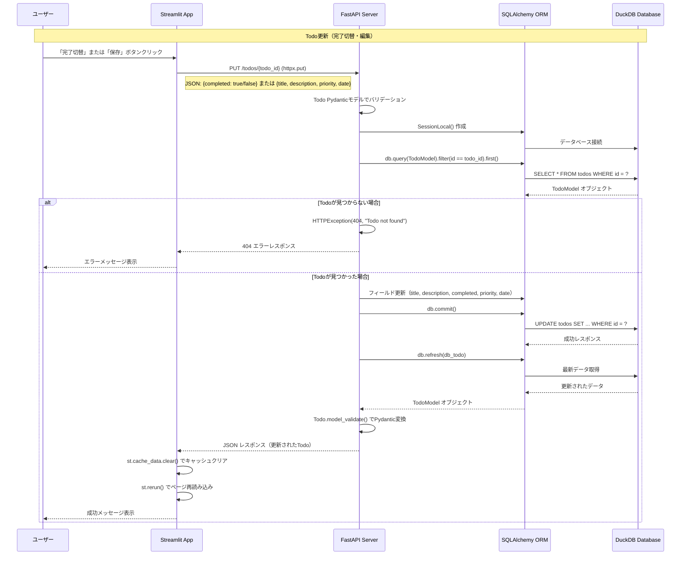
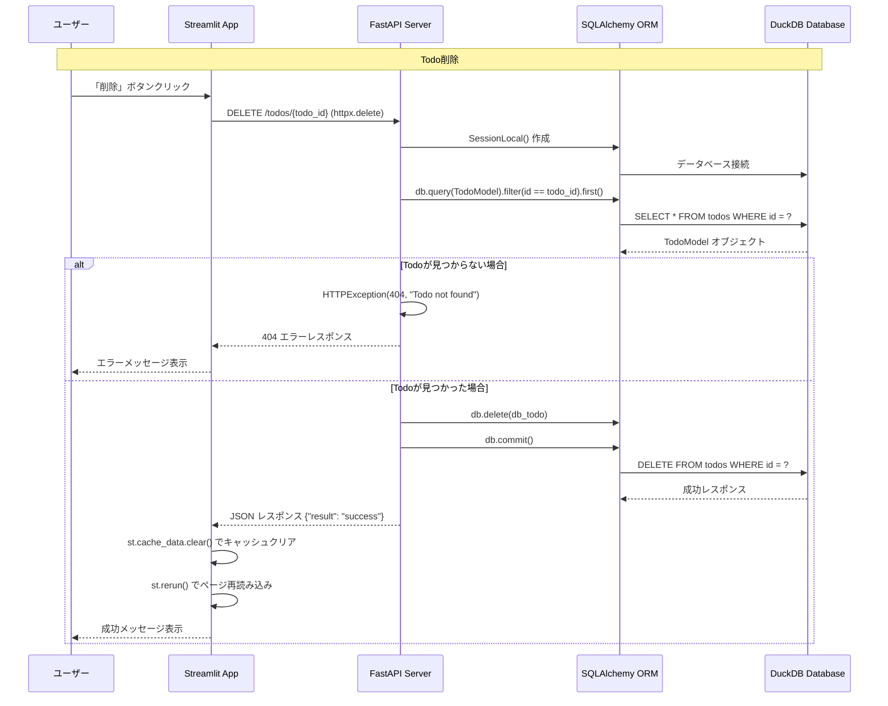
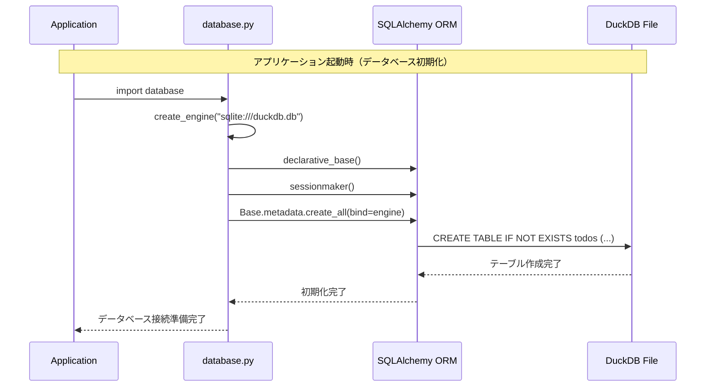
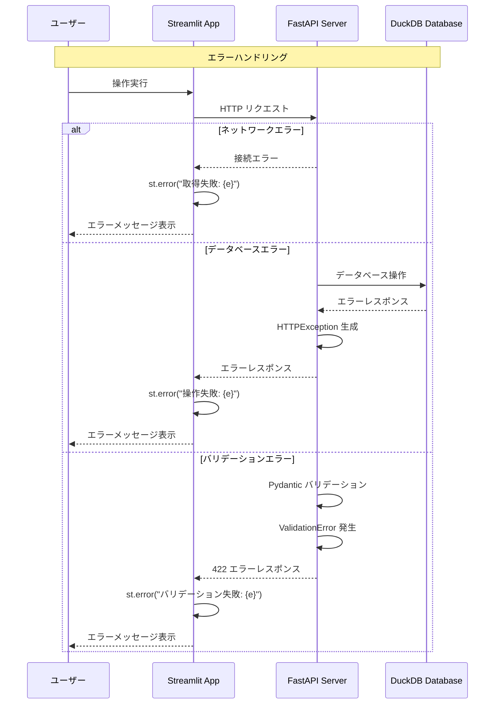
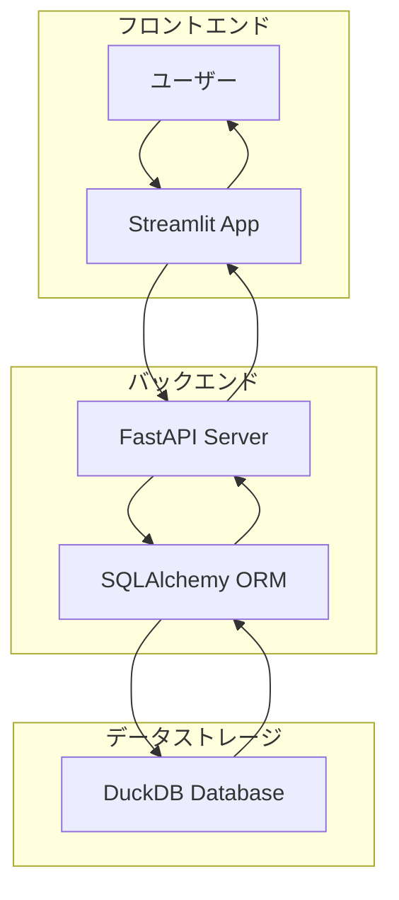

# FastAPI + DuckDB + Streamlit Todoアプリケーション - シーケンス図

## システム概要

このアプリケーションは以下のコンポーネントで構成されています：
- **Streamlit Frontend**: ユーザーインターフェース
- **FastAPI Backend**: REST APIサーバー
- **DuckDB Database**: データストレージ
- **SQLAlchemy ORM**: データベース操作

## 1. アプリケーション起動時の処理フロー

## 2. 新規Todo作成の処理フロー

## 3. Todo更新の処理フロー

## 4. Todo削除の処理フロー

## 5. データベース初期化の処理フロー

## 6. エラーハンドリングの処理フロー

## 7. システム全体のアーキテクチャ図

## 技術的な詳細

### データフロー
1. **ユーザー操作** → Streamlit UI
2. **HTTP リクエスト** → FastAPI Server
3. **データベース操作** → SQLAlchemy ORM → DuckDB
4. **レスポンス** → FastAPI → Streamlit → ユーザー

### キャッシュ戦略
- Streamlitは `@st.cache_data(ttl=5)` で5秒間キャッシュ
- データ変更時は `st.cache_data.clear()` でキャッシュクリア
- `st.rerun()` でページ再読み込み

### セッション管理
- 各APIリクエストで新しいデータベースセッションを作成
- `try-finally` ブロックでセッションの適切なクローズを保証

### バリデーション
- **Pydantic**: API リクエスト/レスポンスのバリデーション
- **SQLAlchemy**: データベーススキーマの制約
- **Streamlit**: フロントエンドでの入力検証 